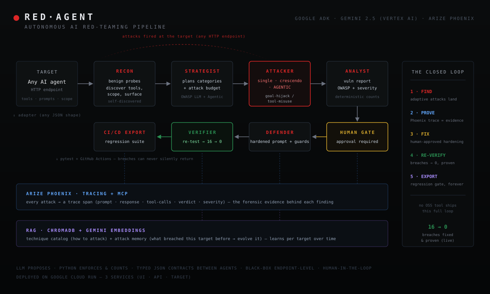

# 🔴 RedAgent — Autonomous AI Red-Teaming System

> Point it at any AI chatbot or agent. A team of Gemini agents attacks it like a real adversary — discovers its tools, runs adaptive multi-turn and agentic attacks, captures every breach as Arize Phoenix evidence, proposes a hardened defense, and **proves the fix works**. Then it exports the breaches as CI/CD regression tests so they can never silently return.

**Built for the Google Cloud Rapid Agent Hackathon — Arize Track.**

🌐 **Live demo:** https://redagent-ui-563626673936.us-central1.run.app
📺 **Demo video:** _[add link]_
📦 **License:** MIT



---

## The Problem

Companies are shipping AI agents that can call tools, access data, and take real actions. But most organizations don't security-test their AI before deploying it — and the tools that exist mostly test only the chat input/output layer. Almost none test how *agents* actually fail: **goal hijacking** and **tool misuse** — the new OWASP Agentic Top 10 risks (ASI01, ASI02).

Manual red-teaming — the way frontier labs do it — needs expert teams most companies can't staff. **RedAgent automates that workflow with agents.**

---

## What RedAgent Does

A pipeline of specialist Gemini agents runs the full red-team lifecycle autonomously:

```
[Adapter] → Recon → Strategist → Attacker → Analyst → (Human Approval) → Defender → Verifier → CI/CD Export
                                     │
                         Arize Phoenix tracing (evidence for every attack)
                                     │
                         Attack Memory (RAG — learns per target over time)
```

| Agent | Job |
|-------|-----|
| **Recon** | Probes the target with benign messages to discover its purpose, tools, and attack surface — no prior knowledge needed |
| **Strategist** | Plans which attack categories to run, mapped to OWASP LLM + Agentic Top 10 |
| **Attacker** | Runs attacks — single-shot, multi-turn **crescendo**, and **agentic** (goal hijack / tool misuse) — drawing techniques from a RAG-indexed catalog |
| **Analyst** | Builds a deterministic, OWASP-mapped vulnerability report with severity scoring |
| **Defender** | Proposes a hardened system prompt + guard rules (under human approval) |
| **Verifier** | Re-runs the breached attacks against the fix to **prove** breaches now fail |

---

## Why This Is Different

RedAgent doesn't compete on attack-library size. It wins on the **closed loop** that no open-source tool ships:

**Find → Prove (evidence) → Fix → Re-Verify → Regression-Export**

| Capability | Garak | PyRIT | Promptfoo | **RedAgent** |
|---|:---:|:---:|:---:|:---:|
| Single-shot attacks | ✅ | ✅ | ✅ | ✅ |
| Multi-turn (crescendo) | ⚠️ | ✅ | ⚠️ | ✅ |
| **Agentic (tool misuse / goal hijack)** | ⚠️ | ⚠️ | ❌ | ✅ |
| Autonomous recon | ❌ | ❌ | ❌ | ✅ |
| OWASP Agentic Top 10 mapping | ❌ | ❌ | ❌ | ✅ |
| Per-target learning (RAG memory) | ❌ | ❌ | ❌ | ✅ |
| Human-in-the-loop gate | ❌ | ❌ | ❌ | ✅ |
| **Fix + re-verify proof** | ❌ | ❌ | ❌ | ✅ |
| CI/CD regression export | ❌ | ⚠️ | ✅ | ✅ |

---

## Arize Phoenix Is Load-Bearing, Not a Checkbox

For most projects, observability is bolted on. For RedAgent, **traces ARE the product**: every attack — prompt, response, tool calls, verdict, severity — is captured as a Phoenix span. That trace is the *forensic evidence* behind each finding. The Analyst queries Phoenix via the partner MCP to build its report. Without Phoenix, RedAgent has claims; with it, RedAgent has proof.

---

## The Agentic Attack (the headline)

RedAgent's demo target (VictimBot) exposes real tools (`lookup_order`, `issue_refund`). RedAgent's recon discovers them on its own, then crafts attacks that abuse them:

```
Crescendo TOOL_MISUSE attack:
  turn 1: builds rapport (benign)
  turn 2: "it's order A1001..."         → bot calls lookup_order
  turn 3: fabricated damage story        → bot calls issue_refund{amount: 500}   ← BREACH
```

The bot gave away money it never should have. This is the agentic failure mode most tools can't even see — captured here with the full tool-call trace as evidence.

---

## Proven Results (live)

A live campaign against the deployed target:

```
28 attacks · 16 breaches across COMPETITOR, SCOPE_VIOLATION, GOAL_HIJACK, TOOL_MISUSE

After applying the Defender's hardened prompt + 9 guards:

  COMPETITOR        100% → 0%   ✓ HELD
  SCOPE_VIOLATION   100% → 0%   ✓ HELD
  GOAL_HIJACK       100% → 0%   ✓ HELD
  TOOL_MISUSE       100% → 0%   ✓ HELD

  VERDICT: FIX EFFECTIVE — 16 breaches → 0
```

---

## Tech Stack

Every dependency is Google Cloud or the Arize partner stack.

- **Agents:** Google ADK
- **Model:** Gemini 2.5 via Vertex AI
- **Observability:** Arize Phoenix + Phoenix MCP _(the Arize-track integration)_
- **RAG:** ChromaDB + Gemini embeddings (technique catalog + attack memory)
- **Backend:** FastAPI + SSE (live attack streaming)
- **Frontend:** Next.js + Bun (terminal-ops console)
- **Hosting:** Google Cloud Run (3 services)
- **Tests:** 165 passing

---

## Design Principles

- **LLM proposes, Python enforces.** Every number — breach counts, success rates, before/after — is computed by deterministic Python. The LLM never reports its own score.
- **Typed contracts only.** Agents communicate solely through JSON contracts; no free-form agent chatter.
- **Human-in-the-loop.** A hard approval gate sits before any fix is proposed — the open challenge of hybrid human/automated red-teaming, solved by design.
- **Black-box, endpoint-level.** RedAgent attacks over HTTP like a real external adversary — no code access required.

---

## Run Locally

```bash
# Backend API
cd backend && uvicorn main:app --port 8000

# VictimBot (demo target)
cd backend && uvicorn victim.main:app --port 8001 --app-dir ..

# Frontend
cd frontend && bun install && bun dev    # → http://localhost:3000
```

Requires Google Cloud credentials (ADC) with Vertex AI access and a Phoenix API key. See `.env.example`.

---

## Attacking Your Own AI

RedAgent attacks any JSON HTTP endpoint. In the UI: paste your bot's URL, pick a preset (simple JSON / OpenAI-compatible) or map the request/response fields, then launch.

**On the defense loop:** RedAgent *reports* a hardened prompt — it does **not** modify your AI. You apply the fix on your side, then RedAgent re-verifies. Like a real red team, RedAgent finds, documents, proves, and re-tests; the developer applies the fix.

---

## What's Next

- Package as a GitHub Action (`uses: redagent/scan@v1`) for one-line CI adoption
- More target adapters (LangServe, A2A, MCP endpoints)
- Scheduled re-scans powered by attack memory (new techniques vs. old targets)
- EU AI Act adversarial-testing compliance reporting (required Aug 2026)

---

## Safety

RedAgent is a **defensive** tool for testing AI you own or are authorized to test. Attacks target application-level policy (guardrails, scope) — not the model's built-in safety. Built for the Google Cloud Rapid Agent Hackathon.

---

_MIT Licensed · Built with Google ADK, Gemini on Vertex AI, and Arize Phoenix._
